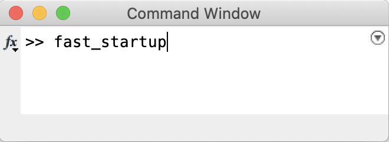
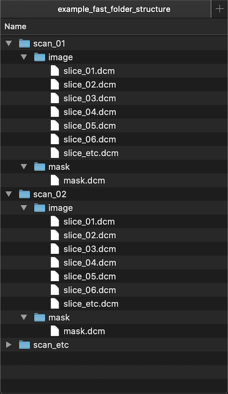

# FAST
*Note: the FAST repository is a work-in-progress, and new code/documentation is being added continually. Thus, some of the code and data referred to in the readme here will not be present yet — in this case, please be patient, and take the information provided more as a plan of the structure of this repository, and keep checking back.* 

Welcome to the repository for the radiomics and image processing software FAST, created and maintained by the Department of Cancer Imaging at King's College London (KCL). Our GitHub Pages website is [here](https://cancerimagingkcl.github.io/), and our King's website is [here](https://www.kcl.ac.uk/bmeis/our-departments/cancer-imaging).  

Our software is compliant with the standards set by the Image Biomarker and Standardisation Initiative, [IBSI](https://theibsi.github.io/), is written for use within Matlab, and is provided under a BSD 3-Clause License. We have contributed to both phases of the IBSI so far, namely, radiomics features (phase 1) and convolutional filters (phase 2), and the code provided here is split according to those, with another section, the benchmarking folder, for reproducing the IBSI tests. There is also a utilities folder, for bits and pieces that come in handy generally (image import, resegmentation, resampling, etc.) and a folder for segmentation, for which, here, using the [OHIF Viewer plugin](https://wiki.xnat.org/xnat-ohif-viewer/) for XNAT is recommended. In that folder, then, there is information on how to run XNAT locally, within the department (this information will not be of much use to anyone outside the King's Cancer Imaging Department). Each of these has further documentation below. Thanks for visiting, and enjoy FAST. 

## PREREQUISITES
- FAST runs in [Matlab](https://uk.mathworks.com/products/matlab.html).

## IBSI compliance
FAST has contributed to, and been tested against, consensus IBSI values, with the aim of making biomedical image processing and analysis more reproducible. In the folder titled "benchmarking", we provide spreadsheets with our results on phantom and real data, compared to the consensus values defined by IBSI. There are also Matlab scripts to reproduce the analysis, which can be used to get familiar with how to use FAST, or to help in testing your own implementations, should you have them. 

## STARTING FAST
Download the code on the dropdown "Code" button, above, and then unzip it to somewhere convenient on your computer. To run FAST in Matlab, the first thing to be done is to navigate to the FAST folder within Matlab. Use this button:  to bring up the folder browser. Next, type `fast_startup` in the Matlab command window, like so:

and press enter. This command tells Matlab where to look for all the FAST folders and files, and should be done every time Matlab is started. 

## STARTING A PROJECT IN FAST
The next step of using FAST is to begin a project. Really, this involves only importing the images and masks, and saving them and their metadata as Matlab .mat files. This makes all subsequent steps quicker and easier for Matlab. 

Before you begin, FAST expects a particular folder structure. This is important. It is much easier for FAST to run with a stereotyped folder structure, and it also forces a certain degree of organisation. The data should be organised this way:

so that images and masks are in their own folders, each one a subfolder of a parent folder. It is expected that the images will be in DICOM format, and that the masks will be an RTSTRUCT DICOM format. And please, do not put any spaces, or any other characters besides letters, numbers and underscores, in the folder and file names.

Then, to begin the project, importing the files as saving them as .mat files, type `start_fast_project` in the command window (the same way `fast_startup` was done, earlier). You'll be asked to find or create an empty folder, in which the folder structure defined above will be replicated, and the images and masks saved as .mat files — choose somewhere sensible and convenient for this folder, as you'll need its location for all subsequent steps. You will also be asked to locate the scans folder — this should be the top-level folder of your data, so, in the example above, this would be "example_fast_folder_structure". 

## UTILITIES
In this section, there are Matlab functions and scripts for the jobs you'll need to do frequently, for any processing and analysis pipeline. Things such as loading images and regions of interest (ROIs), or calculating diagnostic measures of image data, and resampling and resegmentation. Each distinct functionality is documented below, with instructions on how to use them.

### Image and ROI import

### Resampling
*Documentation to come.*

### Resegmentation
*Documentation to come.*

### Diagnostic measures
*Documentation to come.*

## RADIOMICS FEATURES
Here, there is code to calculate a number of radiomic features, grouped according to these categories:
- Morphological
- Intensity-based
- Histogram-based
- Grey level co-occurrence matrix-based

### Using FAST for radiomics features

*Below is more detail on the feature calculations available within each category.*

### Mophological features
*Documentation to come.*

### Intensity-based features
*Documentation to come.*

### Histogram-based features
*Documentation to come.*

### Grey level co-occurrence matrix-based features
*Documentation to come.*

## CONVOLUTIONAL FILTERS
In this section, there is code for image filtering. As with the radiomic features, they are grouped according to some categories:
- Mean
- Laplacian of Gaussian
- Laws Kernels
- Gabor
- Wavelets

And there is documentation on each, and how to use them, below.

### Mean filter
*Documentation to come.*

### Laplacian of Gaussian filter
*Documentation to come.*

### Laws Kernels
*Documentation to come.*

### Gabor filter
*Documentation to come.*

### Wavelets
*Documentation to come.*
